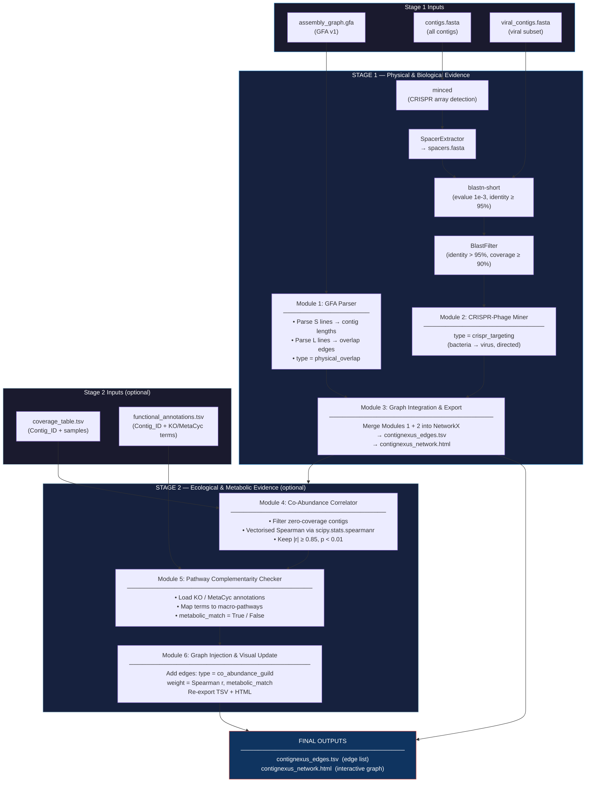

# ContigNexus

**Reconstruct inter-contig interactions from low-depth metagenomic data — without MAG binning.**

ContigNexus is a modular Python pipeline that combines four independent evidence layers into a
single interactive network graph. Instead of relying on metagenome-assembled genomes (MAGs), it
works directly on assembled contigs to reveal ecological and functional relationships between
bacterial and viral members of a microbial community.

---

## Table of Contents

1. [Overview](#overview)
2. [Pipeline Flowchart](#pipeline-flowchart)
3. [Stage 1 — Physical & Biological Evidence](#stage-1--physical--biological-evidence)
   - [Module 1: GFA Parser](#module-1-gfa-parser)
   - [Module 2: CRISPR-Phage Miner](#module-2-crispr-phage-miner)
   - [Module 3: Graph Integration & Export](#module-3-graph-integration--export)
4. [Stage 2 — Ecological & Metabolic Evidence](#stage-2--ecological--metabolic-evidence)
   - [Module 4: Co-Abundance Correlator](#module-4-co-abundance-correlator)
   - [Module 5: Pathway Complementarity Checker](#module-5-pathway-complementarity-checker)
   - [Module 6: Graph Injection & Visual Update](#module-6-graph-injection--visual-update)
5. [Input File Specifications](#input-file-specifications)
6. [Output File Specifications](#output-file-specifications)
7. [Installation](#installation)
8. [Usage — All Run Schemes](#usage--all-run-schemes)
9. [Visual Encoding](#visual-encoding)
10. [Running Tests](#running-tests)
11. [Project Structure](#project-structure)
12. [Scientific Background](#scientific-background)

---

## Overview

Low-depth metagenomic sequencing produces fragmented assemblies that are too sparse for
conventional binning. ContigNexus bridges this gap by constructing a **multi-evidence interaction
network** directly from raw assembly outputs:

| Evidence Layer | Source Tool | Edge Type | Stage |
|---|---|---|---|
| Physical Overlap | Assembly Graph (GFA) | `physical_overlap` | 1 |
| CRISPR-Phage Targeting | minced + BLAST | `crispr_targeting` | 1 |
| Co-Abundance Guild | Coverage Table (Spearman) | `co_abundance_guild` | 2 |
| Metabolic Complementarity | Functional Annotations | flag on `co_abundance_guild` | 2 |

The result is a **standalone interactive HTML graph** plus a **machine-readable TSV edge list**
ready for downstream ecological analysis.

---

## Pipeline Flowchart



> **Tip:** GitHub renders Mermaid diagrams natively. Open this README on GitHub to see the flowchart.

---

## Stage 1 — Physical & Biological Evidence

### Module 1: GFA Parser

**File:** `contignexus/modules/gfa_parser.py`  
**Class:** `GFAParser` | **Function:** `parse_gfa()`

Parses a [GFA v1](https://github.com/GFA-spec/GFA-spec/blob/master/GFA1.md) assembly graph to extract:

- **S (Segment) lines** → contig node with `length` attribute (bp).  
  Length is read from the `LN:i:<n>` optional tag; falls back to sequence string length.
- **L (Link) lines** → undirected overlap edge with attributes:
  - `type = "physical_overlap"`
  - `overlap_cigar` (e.g., `"55M"`)
  - `from_orient` / `to_orient` (`"+"` or `"-"`)

Nodes referenced in L lines before their S line are created lazily with `length=0` and updated on arrival of the S line.

```python
from contignexus.modules.gfa_parser import parse_gfa

graph = parse_gfa("assembly_graph.gfa")
print(graph.number_of_nodes(), "contigs")
print(graph.number_of_edges(), "physical overlaps")
```

| Exception | Trigger |
|---|---|
| `FileNotFoundError` | GFA file not found |
| `ValueError` | No valid S lines in file |

---

### Module 2: CRISPR-Phage Miner

**File:** `contignexus/modules/crispr_miner.py`  
**Class:** `CRISPRPhageMiner`  
**Sub-components:** `MincedRunner`, `SpacerExtractor`, `BlastRunner`, `BlastFilter`

Four-step workflow for detecting CRISPR-mediated phage targeting:

```
Step 1  minced ────────────────► detect CRISPR arrays in contigs.fasta
Step 2  SpacerExtractor ────────► parse minced output → spacers.fasta
Step 3  blastn-short ───────────► align spacers vs viral_contigs.fasta
          (-task blastn-short -evalue 1e-3 -perc_identity 95)
Step 4  BlastFilter ────────────► keep: identity > 95 % AND coverage ≥ 90 %
```

Edges added to the graph:

| Attribute | Value |
|---|---|
| `type` | `"crispr_targeting"` |
| `identity` | Percent identity (float) |
| `coverage` | Fraction of spacer aligned (float) |
| `evalue` | BLAST e-value |

Edges are **directed**: bacterial contig (spacer source) → viral contig (BLAST subject).

**Requirements:** `minced` and NCBI BLAST+ (`blastn`, `makeblastdb`) must be on `$PATH`.

```python
from contignexus.modules.crispr_miner import CRISPRPhageMiner
import networkx as nx

graph = nx.MultiGraph()
miner = CRISPRPhageMiner(graph=graph)
miner.run(
    contigs_fasta="contigs.fasta",
    viral_contigs_fasta="viral_contigs.fasta",
    work_dir="workdir/",
)
```

---

### Module 3: Graph Integration & Export

**File:** `contignexus/modules/graph_exporter.py`  
**Class:** `GraphExporter` | **Function:** `export_graph()`

Merges all evidence already in the NetworkX graph and writes two output files.

#### `contignexus_edges.tsv` (TSV edge list)

| Column | Description |
|---|---|
| `Source_Contig` | Origin node ID |
| `Target_Contig` | Destination node ID |
| `Evidence_Type` | `Physical` / `CRISPR` / `Co-Abundance` |
| `Weight_or_Identity` | Overlap CIGAR string / % identity / Spearman r |
| `Source_Length` | Source contig length (bp) |
| `Target_Length` | Target contig length (bp) |

#### `contignexus_network.html` (interactive visualization)

Built with [PyVis](https://pyvis.readthedocs.io/) (vis.js backend).  
Supports pan, zoom, hover tooltips, drag, and keyboard navigation.

---

## Stage 2 — Ecological & Metabolic Evidence

### Module 4: Co-Abundance Correlator

**File:** `contignexus/modules/ecological_miner.py`  
**Class:** `CoAbundanceCorrelator`

Computes pairwise **Spearman rank correlations** across all non-zero-coverage contigs.

**Algorithm:**

1. Read `coverage_table.tsv` with pandas (`Contig_ID` as index).
2. Remove contigs with zero coverage across all samples (noise reduction).
3. Require ≥ 3 samples (raises `ValueError` otherwise).
4. Compute the full n × n correlation matrix using a single vectorised
   `scipy.stats.spearmanr(matrix, axis=1)` call — handles tens of thousands of contigs efficiently.
5. Extract upper-triangle pairs passing both thresholds: **|r| ≥ 0.85** and **p < 0.01**.

| Parameter | Default | CLI flag |
|---|---|---|
| Spearman threshold | `0.85` | `--spearman-threshold` |
| p-value threshold | `0.01` | `--p-value-threshold` |

---

### Module 5: Pathway Complementarity Checker

**File:** `contignexus/modules/ecological_miner.py`  
**Class:** `PathwayComplementarityChecker`

For each correlated pair from Module 4, checks whether the two contigs share a **macro-pathway**.

**Accepted annotation formats:**

```
# Two-column layout
Contig_ID   KO_terms               MetaCyc_terms
contig_1    K00001,K00360
contig_2    K00001

# Single-column layout (spec default — mixed KO + MetaCyc in one column)
Contig_ID   functional_terms
contig_1    K00001,K00360,PWY-5690
contig_2    K00001,GLYCOLYSIS-TCA-GLYOX-BYPASS
```

Both formats are auto-detected; all term columns are parsed.

**Built-in macro-pathway dictionary:**

| Pathway | Example terms |
|---|---|
| `carbon_metabolism` | K00001, K00360, GLYCOLYSIS, TCA CYCLE, ... |
| `nitrogen_metabolism` | K02303, K10944, DENITRIFICATION-PWY, ... |
| `sulfur_metabolism` | K11180, K11181, PWY-5350, ... |
| `phosphorus_metabolism` | K01077, K01113, PWY-5415, ... |
| `photosynthesis` | K02703, K02704, LIGHT-RXN-PWY, ... |
| `fatty_acid_metabolism` | K00059, K00209, FASYN-INITIAL-PWY, ... |

Sets `metabolic_match = True` if both contigs map to ≥ 1 shared pathway.

---

### Module 6: Graph Injection & Visual Update

**File:** `contignexus/modules/ecological_miner.py`  
**Classes:** `EcologicalGraphInjector`, `EcologicalMiner`

Injects co-abundance results into the NetworkX graph inherited from Stage 1:

| Attribute | Value |
|---|---|
| `type` | `"co_abundance_guild"` |
| `weight` | Spearman r (float) |
| `p_value` | Paired p-value (float) |
| `metabolic_match` | `True` / `False` |

After injection, re-exports both TSV and HTML with the full multi-evidence graph.  
HTML tooltips on co-abundance edges display the Spearman r value interactively.

---

## Input File Specifications

### Stage 1 (required)

| File | Format | Description |
|---|---|---|
| `assembly_graph.gfa` | GFA v1 | Assembly graph from MEGAHIT (`assembly_graph.gfa`) or metaSPAdes (`assembly_graph_after_simplification.gfa`) |
| `contigs.fasta` | FASTA | All assembled contigs (input to minced) |
| `viral_contigs.fasta` | FASTA | Viral contig subset from e.g. [geNomad](https://github.com/apcamargo/genomad) or [DeepVirFinder](https://github.com/jessieren/DeepVirFinder) |

### Stage 2 (optional)

| File | Format | Description |
|---|---|---|
| `coverage_table.tsv` | TSV | Coverage matrix: `Contig_ID` + one column per sample (mean depth). Standard output from CoverM, jgi_summarize_bam_contig_depths, or samtools. |
| `functional_annotations.tsv` | TSV | Annotations: `Contig_ID` + comma-separated KO/MetaCyc terms. Accepts one combined column or separate `KO_terms` / `MetaCyc_terms` columns. From Prokka + KofamScan, DRAM, or similar tools. |

**Example `coverage_table.tsv`:**
```
Contig_ID    sample_1    sample_2    sample_3    sample_4    sample_5
contig_001   14.3        22.1        31.8        40.5        52.0
contig_002   14.9        22.8        32.0        41.1        51.8
contig_003   5.1         48.0        3.2         0.9         10.4
```

**Example `functional_annotations.tsv` (two-column layout):**
```
Contig_ID    KO_terms          MetaCyc_terms
contig_001   K00001,K00360
contig_002   K00001
contig_003   K02703
```

**Example `functional_annotations.tsv` (single-column layout):**
```
Contig_ID    functional_terms
contig_001   K00001,K00360,GLYCOLYSIS
contig_002   K00001,TCA-CYCLE
contig_003   K02703,LIGHT-RXN-PWY
```

---

## Output File Specifications

| File | Location | Description |
|---|---|---|
| `contignexus_edges.tsv` | `<output-dir>/` | Machine-readable edge list (6 columns, tab-separated) |
| `contignexus_network.html` | `<output-dir>/` | Standalone interactive HTML — open in any modern browser |
| `spacers.fasta` | `<output-dir>/workdir/` | Extracted CRISPR spacer sequences |
| `spacer_vs_viral.tsv` | `<output-dir>/workdir/` | Raw BLAST tabular output (outfmt 6) |
| `minced_output.txt` | `<output-dir>/workdir/minced/` | Raw minced CRISPR detection output |
| `minced_output.gff` | `<output-dir>/workdir/minced/` | minced output in GFF3 format |

---

## Installation

### Prerequisites

- Python ≥ 3.10
- [minced](https://github.com/ctSkennerton/minced) — CRISPR detection
- [NCBI BLAST+](https://blast.ncbi.nlm.nih.gov/doc/blast-help/downloadblastdata.html) — `blastn` + `makeblastdb`

### Install Python package

```bash
# From source (editable install — recommended for development)
git clone <repo-url>
cd contignexus
pip install -e .

# Install Python dependencies only
pip install -r requirements.txt
```

### Install external tools

```bash
# Conda (recommended — handles all bioinformatics dependencies)
conda install -c bioconda minced blast

# Ubuntu / Debian
sudo apt install ncbi-blast+
# minced: download jar from https://github.com/ctSkennerton/minced/releases

# macOS (Homebrew)
brew install blast
# minced: conda or manual jar download
```

---

## Usage — All Run Schemes

### Scheme 1: Stage 1 only (minimum required inputs)

Physical overlap + CRISPR-phage targeting. No coverage data needed.

```bash
python -m contignexus \
    --gfa    assembly_graph.gfa \
    --contigs  contigs.fasta \
    --viral-contigs viral_contigs.fasta \
    --output-dir results/
```

---

### Scheme 2: Stage 1 + Stage 2 (full pipeline, no annotations)

Adds co-abundance guilds; metabolic matching is skipped (all `metabolic_match=False`).

```bash
python -m contignexus \
    --gfa    assembly_graph.gfa \
    --contigs  contigs.fasta \
    --viral-contigs viral_contigs.fasta \
    --coverage   coverage_table.tsv \
    --output-dir results/
```

---

### Scheme 3: Full pipeline (all evidence layers)

Stage 1 + Stage 2 with metabolic complementarity. This activates the "Holy Grail" dark-blue edges.

```bash
python -m contignexus \
    --gfa    assembly_graph.gfa \
    --contigs  contigs.fasta \
    --viral-contigs viral_contigs.fasta \
    --coverage   coverage_table.tsv \
    --annotations functional_annotations.tsv \
    --output-dir results/
```

---

### Scheme 4: Full pipeline with verbose logging

Identical to Scheme 3 but prints progress to stdout at DEBUG level.

```bash
python -m contignexus \
    --gfa    assembly_graph.gfa \
    --contigs  contigs.fasta \
    --viral-contigs viral_contigs.fasta \
    --coverage   coverage_table.tsv \
    --annotations functional_annotations.tsv \
    --output-dir results/ \
    --verbose
```

---

### Scheme 5: Custom correlation thresholds

Relax or tighten the Spearman/p-value cutoffs.

```bash
# Stricter: r ≥ 0.95, p < 0.001
python -m contignexus \
    --gfa assembly_graph.gfa \
    --contigs contigs.fasta \
    --viral-contigs viral_contigs.fasta \
    --coverage coverage_table.tsv \
    --annotations functional_annotations.tsv \
    --spearman-threshold 0.95 \
    --p-value-threshold 0.001 \
    --output-dir results_strict/

# More permissive: r ≥ 0.75, p < 0.05
python -m contignexus \
    --gfa assembly_graph.gfa \
    --contigs contigs.fasta \
    --viral-contigs viral_contigs.fasta \
    --coverage coverage_table.tsv \
    --annotations functional_annotations.tsv \
    --spearman-threshold 0.75 \
    --p-value-threshold 0.05 \
    --output-dir results_permissive/
```

---

### Scheme 6: Custom external tool paths

When `minced` or `blastn` are not on `$PATH` (e.g., inside a container or custom install).

```bash
python -m contignexus \
    --gfa assembly_graph.gfa \
    --contigs contigs.fasta \
    --viral-contigs viral_contigs.fasta \
    --minced-bin /opt/tools/minced/minced \
    --blastn-bin /opt/ncbi-blast/bin/blastn \
    --makeblastdb-bin /opt/ncbi-blast/bin/makeblastdb \
    --output-dir results/
```

---

### Scheme 7: Python API — Stage 1 only

```python
from contignexus.pipeline import ContigNexusPipeline

pipeline = ContigNexusPipeline(output_dir="results/")

pipeline.run_stage1(
    gfa_path="assembly_graph.gfa",
    contigs_fasta="contigs.fasta",
    viral_contigs_fasta="viral_contigs.fasta",
)

graph = pipeline.graph
print(f"{graph.number_of_nodes()} contigs, {graph.number_of_edges()} interactions")
```

---

### Scheme 8: Python API — Full pipeline

```python
from contignexus.pipeline import ContigNexusPipeline

pipeline = ContigNexusPipeline(
    output_dir="results/",
    minced_bin="minced",
    blastn_bin="blastn",
    makeblastdb_bin="makeblastdb",
    spearman_threshold=0.85,
    p_value_threshold=0.01,
)

# Stage 1: physical + CRISPR evidence
pipeline.run_stage1(
    gfa_path="assembly_graph.gfa",
    contigs_fasta="contigs.fasta",
    viral_contigs_fasta="viral_contigs.fasta",
)

# Stage 2: ecological + metabolic evidence
pipeline.run_stage2(
    coverage_tsv="coverage_table.tsv",
    annotations_tsv="functional_annotations.tsv",   # optional; pass None to skip
)

graph = pipeline.graph
for u, v, data in graph.edges(data=True):
    if data["type"] == "co_abundance_guild" and data.get("metabolic_match"):
        print(f"HOLY GRAIL: {u} <-> {v}  r={data['weight']:.3f}")
```

---

### Scheme 9: Python API — Use individual modules

```python
import networkx as nx
from contignexus.modules.gfa_parser import parse_gfa
from contignexus.modules.crispr_miner import CRISPRPhageMiner
from contignexus.modules.ecological_miner import EcologicalMiner
from contignexus.modules.graph_exporter import export_graph

# Build graph incrementally
graph = parse_gfa("assembly_graph.gfa")

crispr = CRISPRPhageMiner(graph=graph)
crispr.run("contigs.fasta", "viral_contigs.fasta", work_dir="workdir/")

eco = EcologicalMiner(graph=graph, r_threshold=0.90, p_threshold=0.005)
eco.run(
    coverage_tsv="coverage_table.tsv",
    annotations_tsv="functional_annotations.tsv",
)

tsv_path, html_path = export_graph(
    graph,
    tsv_path="my_edges.tsv",
    html_path="my_network.html",
)
print(f"Written: {tsv_path}, {html_path}")
```

---

### All CLI flags reference

```
usage: contignexus [-h]
                   --gfa FILE
                   --contigs FILE
                   --viral-contigs FILE
                   [--coverage FILE]
                   [--annotations FILE]
                   [--output-dir DIR]
                   [--minced-bin PATH]
                   [--blastn-bin PATH]
                   [--makeblastdb-bin PATH]
                   [--spearman-threshold FLOAT]
                   [--p-value-threshold FLOAT]
                   [-v]

Stage 1 inputs (required):
  --gfa FILE                Assembly graph in GFA v1 format
  --contigs FILE            All assembled contigs FASTA (input to minced)
  --viral-contigs FILE      Viral contig subset FASTA (BLAST subject database)

Stage 2 inputs (optional — omit to run Stage 1 only):
  --coverage FILE           Coverage table TSV: Contig_ID + per-sample coverage columns
  --annotations FILE        Functional annotations TSV: Contig_ID + KO/MetaCyc term columns

Output:
  --output-dir DIR          Directory for all output files (default: contignexus_output)

External tool paths (defaults assume tools are on $PATH):
  --minced-bin PATH         Path to minced executable     (default: minced)
  --blastn-bin PATH         Path to blastn executable     (default: blastn)
  --makeblastdb-bin PATH    Path to makeblastdb executable (default: makeblastdb)

Stage 2 statistical thresholds:
  --spearman-threshold FLOAT  Minimum |Spearman r| for co-abundance edges (default: 0.85)
  --p-value-threshold FLOAT   Maximum p-value for co-abundance edges     (default: 0.01)

Logging:
  -v, --verbose             Enable DEBUG-level logging to stdout
```

---

## Visual Encoding

### Nodes

| Property | Bacterial / Unknown | Viral |
|---|---|---|
| **Shape** | Circle (`dot`) | Triangle (`triangle`) |
| **Color** | Blue `#3498db` | Red `#e74c3c` |
| **Size** | `log(length + 1)`, scaled 10–60 px | Same rule |
| **Tooltip** | Name, type, length (bp) | Name, type, length (bp) |

### Edges

| Evidence Type | Color | Style | Width | Direction | Tooltip content |
|---|---|---|---|---|---|
| `physical_overlap` | Gray `#CCCCCC` | Solid | 4 px | Undirected | CIGAR string, orientation |
| `crispr_targeting` | Red `#FF0000` | Dashed | 2 px | Bacteria → Virus | Identity %, coverage %, e-value |
| `co_abundance_guild` | Light blue `#add8e6` | Solid | 3 px | Undirected | Spearman r, metabolic match |
| `co_abundance_guild` + `metabolic_match=True` | Dark blue `#00008b` | Solid | 5 px | Undirected | Spearman r, metabolic match (**"Holy Grail"**) |

---

## Running Tests

```bash
# Install dev dependencies
pip install -e ".[dev]"

# Run all tests
pytest contignexus/tests/ -v

# With coverage report
pytest contignexus/tests/ -v --cov=contignexus --cov-report=term-missing

# Run a single test file
pytest contignexus/tests/test_gfa_parser.py -v
pytest contignexus/tests/test_crispr_miner.py -v
pytest contignexus/tests/test_ecological_miner.py -v
pytest contignexus/tests/test_graph_exporter.py -v
```

**Test coverage (34 tests):**

| Test file | What is tested |
|---|---|
| `test_gfa_parser.py` (9 tests) | Segment/link parsing, length inference, error cases, graph injection |
| `test_crispr_miner.py` (8 tests) | Spacer extraction, FASTA format, BLAST filtering (identity + coverage thresholds) |
| `test_ecological_miner.py` (12 tests) | Spearman correlation, zero-coverage removal, sample count check, pathway annotation, graph injection, end-to-end run |
| `test_graph_exporter.py` (7 tests) | TSV header/columns/rows, evidence type mapping, HTML creation, node labels |

---

## Project Structure

```
contignexus/
├── __init__.py               # Package metadata (version, author)
├── __main__.py               # python -m contignexus entry point
├── pipeline.py               # ContigNexusPipeline orchestrator + argparse CLI
├── modules/
│   ├── __init__.py
│   ├── gfa_parser.py         # Module 1: GFA Parser (physical evidence)
│   ├── crispr_miner.py       # Module 2: CRISPR-Phage Miner (biological evidence)
│   ├── graph_exporter.py     # Module 3: Graph Export (TSV + interactive HTML)
│   └── ecological_miner.py   # Modules 4+5+6: Co-abundance, pathways, injection
├── utils/
│   └── __init__.py
├── tests/
│   ├── __init__.py
│   ├── test_gfa_parser.py
│   ├── test_crispr_miner.py
│   ├── test_graph_exporter.py
│   └── test_ecological_miner.py
└── data/
    └── example/              # Placeholder for example input files

pyproject.toml                # Package metadata + dependencies
requirements.txt              # Python runtime dependencies
README.md                     # This file
```

---

## Scientific Background

### Why not MAG binning?

MAG (Metagenome-Assembled Genome) binning requires sufficient read depth to assemble
near-complete genomes. In low-depth metagenomes (< 5× mean coverage), assemblies are fragmented
and binners produce poor-quality, highly contaminated MAGs. ContigNexus bypasses this limitation
by reasoning about contig-level interactions rather than genome-level completeness.

### Evidence Layer Rationale

| Layer | Biological Rationale |
|---|---|
| **Physical overlap** | Contigs sharing assembly graph edges originated from the same genomic locus or physically adjacent regions. They are almost certainly part of the same organism. |
| **CRISPR targeting** | A bacterium's CRISPR spacers record past viral infections. A spacer match to a viral contig implies a direct ecological predator-prey interaction. |
| **Co-abundance guild** | Microorganisms that rise and fall together across independent samples share a niche, host, or metabolic dependency. High Spearman r across many samples is a robust co-occurrence signal that is difficult to explain by chance. |
| **Pathway complementarity** | Co-abundant contigs sharing a macro-pathway may encode complementary enzymes for the same metabolic process — strong evidence of a functional ecological guild (partitioned or redundant metabolism). |

### "Holy Grail" Edges

A **dark blue edge** (`co_abundance_guild` + `metabolic_match=True`) represents the strongest
possible evidence in ContigNexus: two contigs that (1) co-vary statistically across all samples
**and** (2) share a metabolic pathway. This combination — statistical + metabolic evidence — is
the hallmark of a true functional guild.

---

## License

MIT License. See `LICENSE` for details.
